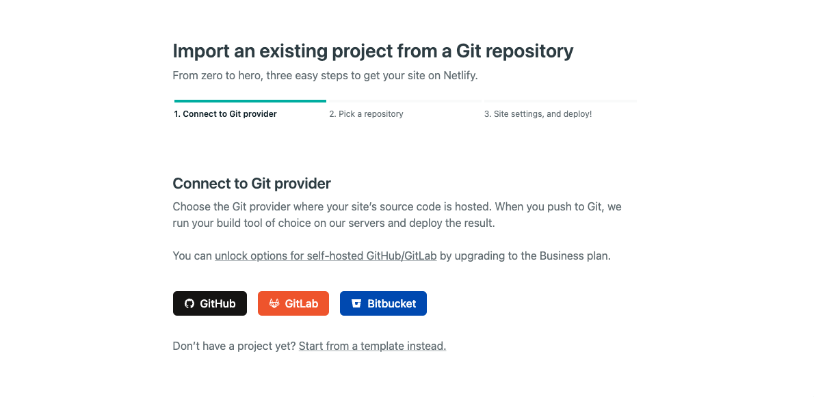
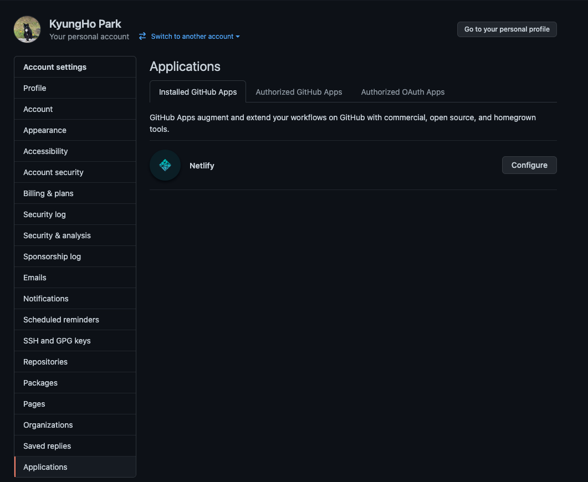
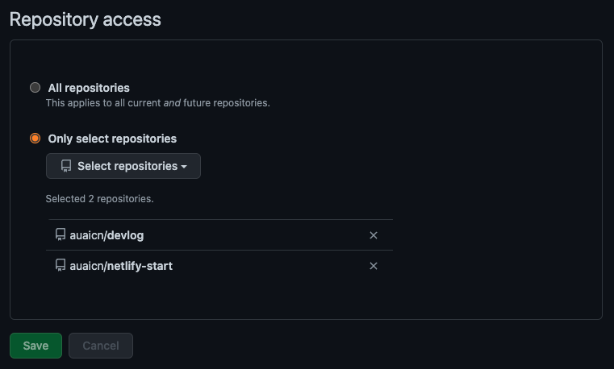
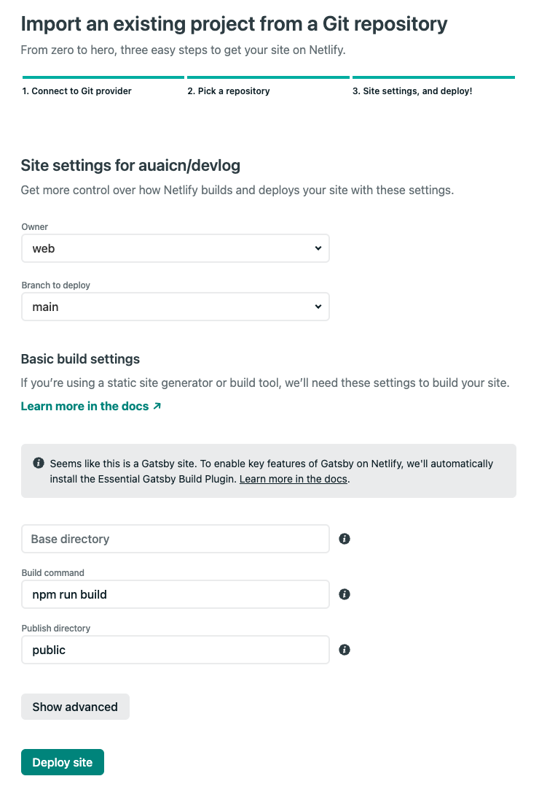
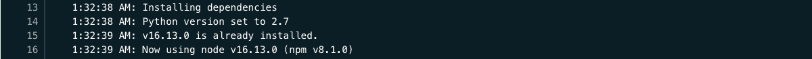
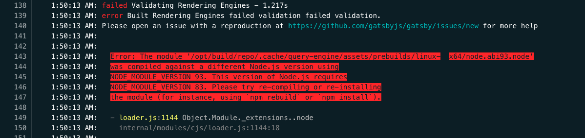
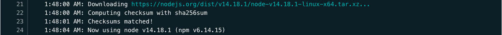

Notion 에 개인적으로 정리하고 있는 것들을, 다른 사람이 볼 수 있도록 그리고 조금 더 정제해서 유지할 수 있도록 블로그를 만들고 싶었다. 드디어 오랜기간 실패했던 블로그 퍼블리싱에 성공했다 :)

Github Pages 를 사용해서도 가능하지만, 여러가지 툴을 사용하고 싶어 찾아보던 중, 친구의 블로그 URL 에 Netlify 가 있는 것을 보고 무엇인지 찾아보았다.

# Netlify

---

Netlify 는 정적 웹사이트를 위한 호스팅 서비스이며 현재 무료로 사용하고 있다. 버전 관리 시스템인 Git 기반의 Gitlab, Github, BitBucket 의 소스코드로부터, 빌드 및 URL 로 접근가능하도록 배포까지 해준다. 실시간으로 빌드 과정의 로그를 확인할 수 있으며, UI 가 직관적이다. Nodejs & Javascript, Swift, PHP, python, Ruby, Rust, Go 기반의 정적 웹 사이트들을 지원하는 것으로 보인다.

# Gatsby

---

우선, Netlify 가 정적 웹사이트를 위한 호스팅 서비스라는 이야기를 했는데, 나는 정적 웹사이트를 만들기 위해 `gatsby` 라는 것을 사용했다. `gatsby`는 bootstrap, tailwindcss 와 비슷하게 정적 웹사이트를 만드는 웹 프레임워크로 이해하였다.

Gatsby 를 잘 모르신다면? [- Gatsby tutorial](https://github.com/gatsbyjs/gatsby-starter-blog)

# How to start

---

먼저, 많은 도움을 받은 웹사이트가 있다. 충분한 내용이 있고, 이보다 더 정확한 정보를 제공하지 못할 것 같다.

[A Step-by-Step Guide: Gatsby on Netlify | Netlify](https://www.netlify.com/blog/2016/02/24/a-step-by-step-guide-gatsby-on-netlify/)

1. 우선 Netlify 에 가입해야 한다.

Netlify 공식 홈페이지 [- Netlify: Develop & deploy the best web experiences in record time](https://www.netlify.com/)

2. 로그인을 한 후, `New Site from Git` 버튼을 클릭한다. 나는 GitHub 로 진행하였다.



3. Netlify 가 나의 Github 계정에 접근하는 것을 허용한다.
   (1. Connect to provider 단계)

최초 1회만 Authorization 을 진행한다.

> Github Profile → Settings → Applications

에 가보면 Installed GitHub Apps 에 Netlify 가 추가된 것을 확인할 수 있다.



4. Netlify 가 접근가능한 레퍼지터리를 선택한다.
   (2. Pick a Repository 단계)

모든 레퍼지터리를 볼 수 있도록 할 수 있으며, 일부 레퍼지터리만 보이도록 설정할 수도 있다.

> Github Profile → Settings → Applications → Netlify → Configure

에서 이후 변경이 가능하다.



5. 선택된 레퍼지터리로부터, 어떻게 웹사이트를 빌드하고 배포할 것인지 설정한다.  
   (3. Site settings, and deploy 단계)

`Owner` 는 팀이라면 팀, 개인이라면 개인을 선택하고, Netlify 의 buildbot 이 바라볼 `Branch` 와, build 명령어가 실행될 위치인 `Base directory` (기본적으로는 / 이다) 그리고 `Build command` 를 입력한다. 이때, 튜토리얼의 gatsby build 명령어는 npm run build 와 다르지 않다. gatsby 를 통해 빌드하게 되면, index.html 등 static web site 는 /public/ 에 위치하게 되므로, 혹시 다르게 설정했다면, `Public directory` 에 해당 디렉터리 이름을 적어주면 된다.



6. Deploy site 를 클릭한다.
   대략 3분정도 소요가 되었던 것 같다. 성공한다면 고민이 끝이겠지만, 한가지 발생할 수 있는 오류에 대해 도움이 되고자 하여 한가지 해결방법을 소개한다. 페이지를 나눌 수 있겠지만, 그래도 이것까지는 설명하고자 한다.

# 로컬 환경과의 Node Version 일치

---

빌드, 배포는 성공하였지만, 로그를 보는 도중, node 버전이 로컬과 다른것을 확인했다.

- Local : v14.18.1
- Deploy 된 버전 : v16.13.0
  

로컬 환경과 일치시키기 위해서는 Deploy Settings 를 일부 조정해야한다.

## Netlify 가 Node Version 을 설정하는 방법

Netlify 구동 환경 (dependency) 관리하기 [- Manage build dependencies](https://docs.netlify.com/configure-builds/manage-dependencies/)

Build, Deploy 는 Netlify 의 buildbot 에 의해 진행된다. 또한 사이트는 내부적으로 docker-container 위에서 동작하게 되는데, 해당 docker-container 에 환경변수를 설정하게 해서, buildbot 이 이를 [자동적으로] 확인하게 하거나, 프로젝트 루트폴더에 .nvmrc 등의 파일에 명시를 해주면 가능하다.

여러가지 방법이 있지만, 환경 변수 설정을 통해 해결하였다.

## 환경변수를 통해 Node Version 일치시키기

1. 아래 명령어를 통해 local 환경에서의 node 버전을 확인한다.

```shell
node -v
```

2. Site settings → Build & Deploy → Environment → Environment variables 에 추가 후 저장한다.

- key : NODE_VERSION

- value : {node -v 의 결과}

3. 이후 Deploys 화면에서 Trigger deploy 를 눌러 배포를 진행한다.

이 때, 꼭 Clear cache and deploy site 를 해주자.
Node Version 등 환경은 buildbot 이 캐시에 저장해두기 때문에 이미 설치되어있는 node 버전과 충돌이 일어날 수 있다.

- **캐시를 삭제하지 않고, Deploy Site 만 누른 경우**
  

- **캐시 삭제 및 배포 옵션을 클릭한 경우**
  

빌드, 배포 로그에서, 로컬환경과 일치하는 노드버전이 사용중임을 확인할 수 있다.
