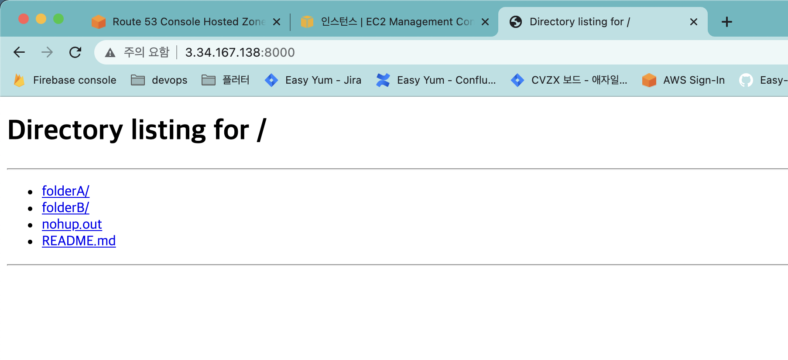

DNS server 기능을 제공하는 AWS 의 `Route 53` 이라는 서비스를 사용하여 <U>서비스</U>의 가용성을 어떻게 높일 수 있는지에 대해서 다루고 있습니다.

위의 <U>서비스</U> 예시로는 AWS EC2 위의 python server 를 사용하였습니다. 서버, Route 53 및 DNS Server 에 대해서는 설명을 드릴 예정이며, EC2 와 python server 에 대해서는 자세히 알 필요 없습니다 😵‍💫

### 서버 및 IP 주소

---

서버는 **하나의 컴퓨터**라고 할 수 있다.

내 컴퓨터에서 애플리케이션이 실행되고 있다면, 내 컴퓨터를 서버라고 할 수 있다.
내 컴퓨터 내에서만 해당 애플리케이션에 접근하는 경우 특히 로컬 서버, 만약 내 컴퓨터가 인터넷에 연결되어 있다면 다른 사람들이 접속할 수 있는 원격 서버가 되는 셈이다.

하지만 원하는 서버와 통신을 하려고 할 때 해당 서버가 어디에 있는지 알아야 통신을 할 수 있을 것이다. 모든 컴퓨터는 IP 주소라고 불리는 주소가 있다. ~~우리는~~ 컴퓨터는 해당 주소를 사용하여 서버와 통신한다.

IP 주소는 다음과 같이 생겼다. [Route53 ]

> 154.69.254.23

### IP 주소의 변동성

---

문제는, 우리가 통신하고자 하는 서버의 ip 는 변할 수 있다. 바뀐 주소가 모른다면 **서버에 접근하지 못한다.**

IP 주소가 변하는 이유는 부족한 IP 주소를 <U>융통성</U> 있게 사용하려한 결과인데, 조금 더 자세히는 아래를 참고하자.

<Collapsable title="얄팍한 코딩사진 - IP주소를 알아봅시다!" titleSize="1rem">
  상당히 구체적으로 알기쉽게 그래픽, 동영상을 가지고 설명해주는 유투버이다.
  <p>
    <a href="https://www.youtube.com/watch?v=GK3h936Co-k&t=1s">얄팍한 코딩사진 - IP주소를 알아봅시다! (Feat. 공인/사설/고정/유동IP, 포트포워딩, DMZ, DDNS)</a>
  </p>
</Collapsable>

### Host

---

호스트는, 주최자 라는 뜻을 가지고 있다. **서버는 하나의 컴퓨터**라는 이야기를 했는데, 해당 서버의 주최자, 주인 정도로 생각하면 된다. **나는 내 서버의 호스트**이며, 내가 접속하고자 하는 애플리케이션 서버의 호스트는 해당 애플리케이션이 실행되고 있는 컴퓨터이다.

### DNS Server

---

최종적으로 사용해보고자 하는 `Route 53` 이라는 서비스는 DNS server 기능을 제공한다고 했다. DNS 라는 것이 무엇일까?
DNS 는 Domain Name System 의 약자이다. `Domain Name` 은 다음과 같은, 컴퓨터를 잘 알지 못해도 누구나 아는 웹사이트 주소를 이야기 한다.

> www.naver.com

<U>서비스</U>앞서 컴퓨터는 IP 주소를 사용하여 서버와 통신한다고 했는데, IP 주소가 아닌 웹사이트 주소는 사용하지 못한다.
여기서 컴퓨터가 웹사이트 주소를 알아 볼 수 있도록, DNS 서버가 웹사이트 주소를 IP 주소로 변환해준다.
<U>우리가 지정한대로!</U>

### DNS Server 를 통한 고가용성

---

<p>
  <U>그렇다면 어떻게 DNS Server 가 가용성을 높일 수 있다는 것일까?</U>
</p>

앞서 서버의 IP 주소는 변할 수 있다고 설명하였다. 만약 변경되기 전, 후의 IP 주소가 다음과 같다고 생각해보자.

- [전] 123.246.23.63
- [후] 111.222.33.44

만약 출시한 모바일 애플리케이션이 특정 IP 주소와 연결되도록 코드를 작성했다면, IP 가 바뀌었을때 해당 사용자가 다운로드 받은 애플리케이션안의 코드를
그때 가서야 바꿀 수 있는 방법은 없을 것이다. 이를 막기 위해, 애플리케이션 코드에는 웹사이트 주소를 삽입해 두는 것이다. 그리고 연결되어 있는 IP 주소를
변경해주기만 하면 된다. IP 가 변경되었을 경우에 대한 장애 대응이 가능해 지는 것이다. 이제 실제로 실습을 진행해보자.

### 실습 환경구성

EC2 인스턴스를 생성하고, 해당 인스턴스의 보안그룹, 인바운드 규칙에 TCP 8000 번을 허용한뒤, 인스턴스 내부에서 다음과 같은 명령어를 실행한다.

```shell
python -V

sudo yum install pip// 필요시
```

저는 AMI 로 Amazon Linux 를 사용하여 yum 을 사용했습니다. Ubuntu 를 사용하고 게시다면, yum 대신 apt-get 명령어를 사용하시면 될 것 같습니다.

```shell
# 위에서 반환된 파이썬 버전이 3.X인 경우
python -m http.server
# 위에서 반환된 파이썬 버전이 2.X인 경우
python -m SimpleHTTPServer
```

8000번 포트를 이미 사용하고 있다면 명령어 뒤에 사용가능한 임의의 포트번호를 붙여주자.

> [예] python -m http.server 7000

파이썬 http 서버 실행에 관해 더 자세히는 [여기](https://developer.mozilla.org/ko/docs/Learn/Common_questions/set_up_a_local_testing_server) 를 참고하자.

파이썬 http 서버 실행에 성공하였다면, 8000번 포트로의 접속이 열려있기 때문에, [EC2 인스턴스의 public IP](https://docs.aws.amazon.com/ko_kr/AWSEC2/latest/UserGuide/using-instance-addressing.html#concepts-public-addresses) 주소를 통해 해당 웹서버에 접근하는 것이 가능하다.

<Collapsable title="public IP 가 없는 경우" titleSize="1rem">
  
  <p>Amazon 제공 기본 VPC 가 아닌 새로운 VPC 에서 인스턴스를 시작하지 않은 경우 public IP 가 없을 수 있습니다. 이 경우 수동으로 추가할 수 있습니다. 예전에는 인스턴스 런칭 후 불가능했지만, 가능해졌다고 합니다. </p>
  <p>
  <a href="https://docs.aws.amazon.com/ko_kr/AWSEC2/latest/UserGuide/using-instance-addressing.html#concepts-public-addresses)">참고 - Amazon EC2 인스턴스 IP 주소 지정]</a> <br/>
  </p>
  <p>
  <a href="https://serverfault.com/questions/706560/assign-public-ip-not-elastic-ip-after-instance-launched">참고 - assign-public-ip-not-elastic-ip-after-instance-launched</a><br/>
  </p>

</Collapsable>



