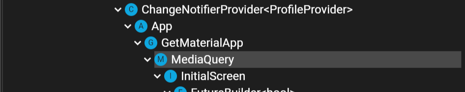

애플리케이션을 출시한 후, 지인들에게 내부 테스트를 부탁했었다. 대부분은 문제삼지 않았지만, 실제 애플리케이션을 개발해본 적 있거나,
디자인에 대해 세심하게 잘 알고 있는 사람들이 공통적으로 주었던 피드백은, **텍스트가 약간 밑에 있는 것으로 보인다** 는 점이었다.

생각하지 못하고 지나칠 수 있는 점들을 나열해본다. <U>3번의 경우, 서비스를 막을 수도 있으니 유의하자.</U>

1. height
2. leadingDistribution
3. textScaleFactor

# 1. height

---
Flutter의 `Text` 위젯은 기본적으로 글자 수에 따라 필요한 만큼만 공간을 차지한다. 넓이는 그에따라 결정된다.

텍스트는 여러 줄이 될 수 있는데, 이때 한 줄, 한 줄의 높이는 어떻게 결정될까?

Text 위젯의 `style` 프로퍼티에 TextStyle 을 직접 만들어주고, 해당 TextStyle 에서 `fontSize` 를 20 으로 준다고 해도,
실제 확인되는 Text 위젯의 높이는 20이 아니고 24였다. 왜 이럴까? 예를 들어 아래 코드를 작성했다고 해보자.

```Dart
Text(
  'font Size 20 with height 1',
  style: TextStyle(fontSize: 20, height: 1),
),
Text(
  'font Size 20 with height not given',
  style: TextStyle(fontSize: 20),
),
Text(
  'font Size 20 with height 1.5',
  style: TextStyle(fontSize: 20, height: 1.5),
),
```

표시되는 화면은 다음과 같다.

<Collapsable title="화면 사진" titleSize="1rem">

  

</Collapsable>


Overlay Guideline 을 함께 표시하였다. `height` 를 1로 준 경우는 크게 차이가 나지 않아 보이지만,
`height` 를 1.5배 준 경우, 확실히 높이가 커진 것이 보일 것이다.

<Collapsable title="Inspector 사진 (height 값을 주지 않은 경우)" titleSize="1rem">

  

</Collapsable>

두번째 텍스트 위젯이 아무런 값도 주지 않은 상태인데, 실제로 확인해보면, height 가 24 임을 알 수 있다.

<Collapsable title="Inspector 사진 (height 1.5 를 준 경우)" titleSize="1rem">

  

</Collapsable>

height 가 1 이거나 1.5일때를 확인해보면 height 값에 비례해서 실제 위젯의 height 가 결정되는 것을 볼 수 있다.
default height 값은 1.2 인 것도 유추해 볼 수 있었다. 이는 **fontfamily 에 따라** 정해진 바 있다고 한다.

### 텍스트 위젯의 높이

---

line height, 즉 한 줄의 픽셀 높이는 fontSize 와 height 를 곱해서 나오는 것이다.

> 텍스트 위젯의 lineHeight = fontSize \* height


### 프로젝트에 전반적으로 적용하기

---

우선적으로는 디자인 요구사항을 따르기 위해 height 값이 다른 여러개의 TextStyle 들을 정의해두고, 재사용 하는 방법을 통해서
텍스트 위젯의 높이에 대한 문제를 해결하였다.

```Dart {8,15}
class DesignerTextStyle {
  ...

  static TextStyle paragraph3 = TextStyle(
    fontSize: 14,
    fontFamily: 'Pretendard',
    fontWeight: FontWeight.w500,
    height: 1.57, // line height : 22
  );

  static TextStyle caption1 = TextStyle(
    fontSize: 14,
    fontFamily: 'Pretendard',
    fontWeight: FontWeight.w500,
    height: 1.57, // line height : 22
  );

  ...
}
```

이후 사용은 다음과 같이 하고 있다.

```Dart {3-6}
Text(
  '${license.name} (v ${license.version})',
  style: DesignerTextStyle.paragraph3.apply(
    fontWeightDelta: 2,
    color: Colors.red,
  )
),
```

기본적으로는 `font-weight` 를 w500 으로 설정해두고, 색상 변경이 필요하거나, 볼드체를 적용해야 하는 경우 `.apply` 함수의 내부에 전달하고 있다.
fontWeightDelta 의 값에 2을 주게 되면, 폰트의 weight 가 w500(Medium) 에서 w700(Bold) 으로 두 단계 뛰게 된다.

<Warning>이때, 사용되는 폰트에 따라 w600 이나 w800 등이 없을 수 있음에 유의하자.</Warning>

# 2. leadingDistribution

--- 

Text 위젯 자체의 height 를 디자이너가 준 시안대로 맞추었음에도, 문제가 있었다.

다음 이미지를 보면 이해할 수 있을 것이다.

<Collapsable title="화면 사진" titleSize="1rem">

  

</Collapsable>

원하는, 디자인으로 나온 것은 아래 파란색과 같았다. 하지만 본문의 1번까지만 적용을 했다면, 붉은 배경의 텍스트 위젯처럼, 텍스트가 아래로 치우치게 된다. 
본문의 1번에서는 height 를 통해 fontSize 외에, 텍스트 위젯이 차지하는 여유 공간을 설정해주었다. 이를 `leading` 이라고 한다. 별 다른 설정이 없다면,
이 `leading` 은 텍스트의 위아래에 <U>동등하지 않은 비율</U>로 나누어지게 된다. 정확히 어떤 비율인지에 대해서는 필요하다면 아래를 참고하자.

<Collapsable title="leading 이 나누어지는 비율 자세하게" titleSize="1rem">

  프론트엔드 개발에 이 정도의 이해까지 필요할지는 몰랐지만, 디자인을 **적용**하는 것은 프론트엔드 개발자의 몫이라는 생각에 조사를 해보았다.

  

  사진에는 `ascent` 와 `descent` 라는 단어가 나온다. 
  
  언어에 따라, 알파벳에 따라 텍스트가 위아래로 삐져나오는 것이 가능한데, 그 상한과 하한정도로 이해하면 편하다.
  `leading` 은 대부분의 font-family 에서 0으로 설정되어있지만, `leading` 을 만들어내면, 텍스트의 위 아래 분배되게 되는데, 그 분배 비율은

  <ol>
    <li> base-line 에서 `ascent` 까지의 길이  </li>
    <li> base-line 에서 `descent` 까지의 길이 </li>
  </ol>
  
  의 비율인 것으로 보인다.

  1번의 길이가 비교적 길다보니, 텍스트가 아래로 치우치는 것으로 보였던 것 같다.

</Collapsable>

아래는 위 사진을 위한 코드이다. 중요한 부분을 하이라이트 해두었다. 

``` Dart {19}
Container(
  color: Colors.red.shade100,
  child: const Text(
    'Hello, world!',
    style: TextStyle(
      fontSize: 40,
      height: 2,
    ),
  ),
),
SizedBox(height: 16),
Container(
  color: Colors.blue.shade100,
  child: const Text(
    'Hello, world!',
    style: TextStyle(
      fontSize: 40,
      height: 2,
      leadingDistribution: TextLeadingDistribution.even,
    ),
  ),
),
```


# 3. textScaleFactor

---

휴대폰의 폰트 사이즈 설정을 본 적 있을 것이다. TextWidget 의 fontSize 를 20으로 설정했지만, <U>시스템 설정</U>에서 전반적인 폰트 사이즈를 키우게 되면,
Text 위젯 내부의 폰트 사이즈도 영향을 받는다. 

실제로 개인정보 처리방침 및 이용약관 동의 텍스트 옆에 버튼을 둔 적 있었는데, 시스템 설정상에서 폰트 사이즈가 크게 되어있는 것이 적용되어
버튼이 화면밖으로 나가 누를수 없어, 동의가 안되니 회원가입을 할 수 없어 Hotfix 배포를 했던 일이 있었다.

애플리케이션 실행간에 화면 사이즈를 가져올때 많이 사용하는 MediaQuery 의 설정에 `textScaleFactor` 를 덮어쓰는 방법으로, 시스템 폰트 사이즈 설정의 개입을 막을 수 있다.

``` Dart {11-14}
@override
Widget build(BuildContext context) {
  return GetMaterialApp(
    ...

    builder: (BuildContext context, Widget widget) {
      ErrorWidget.builder = (FlutterErrorDetails errorDetails) {
        return CustomErrorDevelopment(errorDetails: errorDetails);
      };

      return MediaQuery(
        data: MediaQuery.of(context).copyWith(textScaleFactor: 1.0),
        child: widget,
      );
    },

    ...
  );
}
```

위 코드 적용으로 인한 Widget Tree 는 다음과 같다.

MaterialApp(GetMaterialApp) 과 스크린 사이에 덮어씌워진 MediaQuery 가 위치하게 된다.

