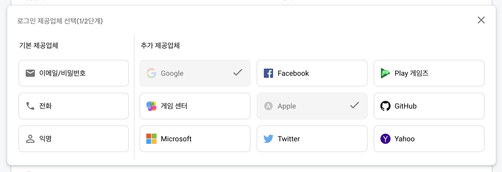

Google 에서 개발한 `Firebase` 는 <U>**모바일 애플리케이션**</U> 개발에 도움이 되는 **여러가지 서비스**를 제공한다.

주로 Google 에서 제공하는 다른 서비스 (ex. Google Ads) 와의 연계가 수월하게 되며,
각 기능 별로 전문화된 서비스에 비해서는 성능이나 가격이 떨어지는 반면 <U>단순함</U>이나, 필요할만한 여러 서비스들이 밀집되어 있다는 점에서<U>접근성은 가장 좋다</U>고 생각이 된다.

Amazon Web Service 역시 Firebase에서 제공하는 다양한 서비스를 제공하는데,
가격면에서 고려했을때는 AWS 가 근소하게 가격이 낮으나 역시 접근성은 Firebase 가 높은 것으로 보인다.

> 파이어베이스가 기본적으로 글로벌 설정이 되어 있어 그런 것이 아닐까 조심스레 추측! 해본다.

# Firebase Products

---

대표적인 `Analytics`, `Authentication` 외에 알고보면 다양한 서비스들을 제공하고 있다.   
인프라나 함께 사용될 서비스와의 연동을 고려하여 `Firebase` 를 사용할지 결정하는 것이 중요하다.

### Analytics

---

사용자 패턴 분석을 위한 서비스.
Firebase Project 를 생성하게되면, 기본적으로 Analytics 사용 설정을 권장하며, 설정하게되면

- `signup` (회원가입)
- `first_open` (앱 설치 후 첫번째 실행)

등의 **이벤트**가 자동으로 기록된다.

<Info>
  회원가입 및 앱 설치 이벤트도 물론 중요하지만, 서비스를 <strong>실제로 사용하는지</strong> 확인하기 위해서는, 서비스의 핵심기능을 이벤트로 등록하고 그 지표를 지켜보는 것이 중요하다.  

  [EX] 식단기록 서비스라면, <strong>식단을 기록하는 이벤트!</strong> 가 실제로 일어나는지 이벤트를 등록하자.
</Info>

### Authentication

---

SSO (Single Sign-On) 하나로 모든 로그인을 하는 것을 돕는 서비스이다.

접근성은 다소 떨어지지만 `이메일-패스워드` 를 통한 로그인 부터, `Google`, `Apple`, `GitHub` 등을 통한 소셜로그인 기능을 하나하나 직접 구현하지 않고, 한번에 애플리케이션에 연동하는 것이 가능하다.

카카오 및 네이버 로그인을 지원하기 위해서는 각각의 **별도 서버**가 필요할 수 있지만, 해당 인증 결과를 사용해 Firebase User 로 등록한 후, 일관성 있게 관리하는 것이 가능하다.

### Cloud Storage

---

이미지 및 모든 타입의 파일을 저장하기 위한 **클라우드 스토리지(디스크)** 이다.  
`버킷` 이라는 곳에 파일들이 저장되며, 기본 요금제 사용시 하나의 버킷만 사용 가능하다.

<Info>
  이미지에 대해서는, 항상 <U>용량</U>을 걱정하고, <U>캐싱</U>을 사용하여 여러번 불러오는 일을 최대한 줄이자!
</Info>

### Cloud Firestore

---

크기에 대해 걱정하지 않아도 되는 자동으로 확장 가능한 **No-SQL 기반의 데이터베이스**이다.  
`문서`와, 문서들의 집합인 `컬렉션` 의 형태로, 계층적으로 파일을 구분한다.

`규칙` 을 정해, `문서` 를 만든 사용자만 볼 수 있도록 접근을 제어할 수도 있다.

### Realtime Database

---

key-value 계층구조로 데이터가 저장된다. 데이터의 변화는 하나의 `이벤트` 로 볼 수 있는데, 여러개의 이벤트는 `stream` 의 형태로 쌓이게 된다.

클라이언트에서는 해당 `stream` 에 대해 지켜볼 수 있는데 (`listen`), 이를 통해 **실시간** 데이터를 사용자에게 지속해서 보여줄 수 있다. 물론 실시간이 아닌 **딱 한번만** 데이터를 불러오는 것도 가능하다.

Firebase 가 서버의 역할을 해 여러 동시 요청이 오는 경우에도 시간대 별로 정렬을 해준다. 대표적으로 <U>채팅</U> 기능을 구현하는 데에 많은 도움이 된다.

### Hosting

---

Static Web Site (HTML/JS/CSS 의 조합) 을 배포하기에 용이한 서비스이다.

무료 플랜이라면 다른 사용자들이 나의 웹사이트에 접속해서 생기는 리소스 다운로드를 월 10GB 까지 허용한다.

  <U>구매한 도메인</U>이 있다면, 이를 연동하는 것도 가능하다.

# Other Services

---

아래는 아직 사용해보지 못한 Firebase 제품군이다.

### ML

---

이부분에 대해서는 깊이 있게 알지 못해 아래 링크를 첨부한다.

대표적으로는 학습된 모델을 업로드 하게 되면, 호스팅을 진행해주며, <U>Google Colab 노트북에서 바로 모델을 배포할 수도 있다</U>고 한다.
ORM (자연어, 텍스트 인식) 및 Vision (이미지 인식) 등의 일반적인 모바일 사용사례에 바로 사용 가능한 API 등을 제공하는 듯 하다.

[Firebase Machine Learning - 모바일 개발자를 위한 머신러닝](https://firebase.google.com/products/ml?gclid=Cj0KCQiAwqCOBhCdARIsAEPyW9lDv7aBBfLrni90DVuvHDrZoW2i2UrIjzoEM2A_tcH9DJ8EL1W1TTcaAqs4EALw_wcB&gclsrc=aw.ds)

### Test Lab

---

여러대의 서로다른 기종의 디바이스에서 자동화된 테스트 하는 것이 가능하다.

PlayStore 에 앱을 제출하게 되면, 여러 디바이스에서 화면이 꺠지는지, 화면이 표시되기 까지 어느정도 오래 걸리는지 테스트를 하게 되는데, 내부적으로 Firebase Test Lab 을 사용하는 것으로 알고 있다.

[Firebase Test Lab - 일반 사용자가 아닌 실험 환경에서 앱 테스트 ](https://firebase.google.com/products/test-lab?gclid=Cj0KCQiAwqCOBhCdARIsAEPyW9kScoSGheexKQhzw0_PggfObJU4lfs_p5hPc5bJSqTgFH-MI6Tmt7YaAifPEALw_wcB&gclsrc=aw.ds)

### Functions

---

`AWS Lambda` 와 비슷한, <U>서버리스</U> 애플리케이션 구축을 위한 서비스이다.

서버를 구축하지 않아도 작성된 코드를 업로드하면, 이를 API call 을 통해 실행(trigger) 할 수 있도록 하는 서비스이다.

[Firebase Functions - 서버를 관리하지 않고 모바일 백엔드 코드 실행](https://firebase.google.com/products/functions?gclid=Cj0KCQiAwqCOBhCdARIsAEPyW9n1cpfvfdEk15gyX_w4XPtmcKD8isOiod-R1u_OZ6QR44XAqV7Uv-IaAhLREALw_wcB&gclsrc=aw.ds)
