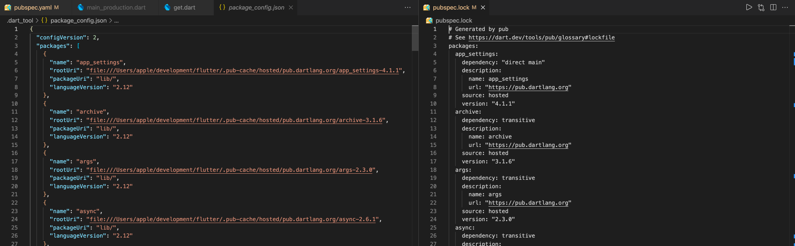
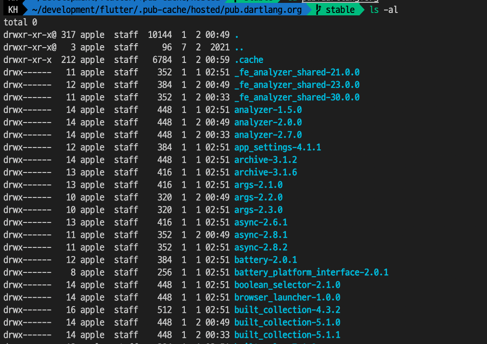
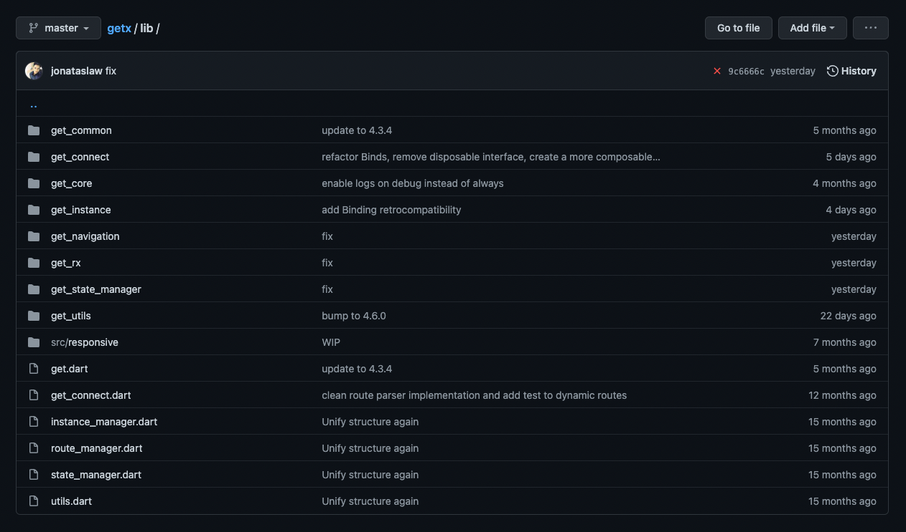

다트 생태계에서는 라이브러리나, 유용한 툴을 공유하고 관리하기 위해 이들 하나하나를 `package` 라 부른다.

패키지는 실행가능한 <U>Tool</U>이 될수도 있고, 플러터의 경우 인자만 전달하면 바로 사용할 수 있는 **위젯**, 혹은 **함수**의 <U>라이브러리</U>도 될 수도 있다. 그 중 많이 사용하는 유형은 **라이브러리** 일 것이다.

최근 공개 패키지 사이트인 [pub.dev](https://pub.dev/) 에서 1등 상태관리 패키지인 `get` 이라는 라이브러리를 설치하고 사용하던 중, import 문을 클릭하였더니, 다음 파일로 이동할 수 있었다.

```dart:title=get/get.dart
/// GetX is an extra-light and powerful multiplatform framework.
/// It combines high performance state management, intelligent dependency
/// injection, and route management in a quick and practical way.
library get;

export 'get_common/get_reset.dart';
export 'get_connect/connect.dart';
export 'get_core/get_core.dart';
export 'get_instance/get_instance.dart';
export 'get_navigation/get_navigation.dart';
export 'get_rx/get_rx.dart';
export 'get_state_manager/get_state_manager.dart';
export 'get_utils/get_utils.dart';
export 'route_manager.dart';
```

평소 패키지를 사용만하고, 직접 만들어본 경험은 없다보니, 위 코드에서 나오는 `library` 및 `export` 라는 키워드가 생소했다.

<Collapsable title="keyword 'library'" titleSize="1rem">

  `Tag` 라고도 불리는 라이브러리의 **이름**을 지정할 수 있는 `directive` 이다. 
  
  위 예시 코드에서는 보면 최상단에 아래 코드가 있다.
  
  ``` dart
  library get;
  ```
  
  `library` 키워드를 통해 지정한 Tag 가 import 문의 가장 앞에 오는 문자가 된다는 것을 알아두자.

</Collapsable>
<Collapsable title="keyword 'export'" titleSize="1rem">

  `pub.dev` 의 모든 패키지는 오픈소스로 공개되어있지만, **내부적으로 사용되는 함수까지 패키지 사용자들에게 노출할 필요는 없다.**
  물론 코드를 볼 수는 있지만, 패키지 사용자는 최상위 레벨의 편리한 기능만 사용하면 되는 것이고, 내부적인 더 작은 위젯, 자료구조 클래스나 함수에 접근할 필요가 없다.

<Info>

  플러터 자동완성 기능에, 사용하지도 않을 세부적인 위젯이 끝도없이 추천되는 상황을 생각해보라.

</Info>

  이러한 이유로 기본적으로 패키지를 만들게 되면, `lib/` 디렉터리 **안에** 있는 다트파일만 패키지 사용자는 접근할 수 있다.
  **안에** 있는 다트파일이란, <U>하부 디렉터리의 다트파일을 포함하지 않는다</U>는 것에 주의하자.

  물론, 하부 디렉터리를 만들어서 코드를 정리하고, 이를 공개하고 싶을 수도 있다. 이럴때 사용하는 키워드가 `export` 키워드 이다.
  이를 통해 패키지를 만드는 사람은, 본인이 원하는 수준까지 패키지 사용자가 접근하도록 제어하는 것이 가능하다.

  ### Native iOS

  플러터에는 패키지가 있듯이, Native iOS 에는 `framework` 이라는 것이 있는데, 역시 클래스 접근에 대해 비슷한 정책을 가진다. 다루어보지 않아 언급하기가 조심스럽지만,
  아마 모든 유용한 프레임워크 사용시 같은 정책을 취하고 있을 것이다.

  - [[참고 1] Swift Docs - Access Control](https://docs.swift.org/swift-book/LanguageGuide/AccessControl.html)
  - [[참고 2] Blog - Access Control](https://zeddios.tistory.com/383)

</Collapsable>

### 패키지의 위치

---

우선 이 파일은 어디에 위치하길래 IDE 를 통해 접근할 수 있고, 코드를 살펴볼 수 있는지 궁금해졌다.

```shell {1,3}
$ flutter pub get
  or
$ dart pub get
```

명령어는 pubspec.yaml 에 적힌 Flutter SDK 및 각 라이브러리 버전의 범위에 따라 의존성을 해결하고, 최종적인 버전의 패키지 코드를 명시된대로

1. Pub.dev 의 CDN 서버
2. Git Repository
3. Local FileSystem

로 부터 다운로드 받아, **System Cache** 에 저장한다.

### System Cache ?

그렇다면, 해당 코드는 System Cache 에 있을 텐데, 그 위치는 어디일까?

`flutter pub get` 혹은 `flutter clean` 을 할 때마다 생성되고 삭제되던, 프로젝트 루트폴더 하위의 `.dart_tool/` 디렉터리의 package_config.json 파일에서 찾아볼 수 있다.



해당 파일의 좌측은 앞서 말한 `package_config.json` 파일이며, 오른쪽은 같은 커맨드에 의해 생성된, `pubspec.lock` 파일로 담고있는 내용이 비슷하다는 것을 확인할 수 있다.
- `pubspec.lock` 파일은, 각각의 패키지에 대한 버전에 대한 정보만 가지고 있으며,
- `package_config.json` 파일은, `pubspec.lock` 이 요구하는 버전의 패키지들에 대한 실제 위치를 담고 있다.

`rootUri` 에 적힌 디렉터리를 가보면, 하나의 패키지라 하더라도 여러가지 버전이 있다는 것을 확인해볼 수 있었다.



<Collapsable title="추가적인 내용" titleSize="1rem">

  추가적으로 각 파일의 끝 부분을 보면, 

  

  `package_config.json` 에는 추가적으로 현재 프로젝트의 위치에 대한 정보도 유지되고 있다는 것을 알 수 있다.

  `package_config.json` 파일이 생성되는것은, [Package Config](https://pub.dev/packages/package_config) 라는 패키지에 의해서인데, 이를 기반으로 동작하는
  `dartdoc` 및 `build_runner` 패키지에서의 쓰임새가 있을것 같다.

</Collapsable>

### References

- [How to use packages](https://dart.dev/guides/packages)
- [Creating packages](https://dart.dev/guides/libraries/create-library-packages)
